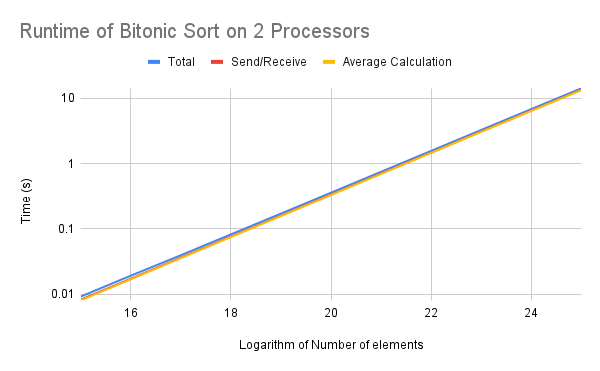

# ParallelComputing CSCE 435 Group project

## 1. Group members:

1. Nathan Mandell
2. Harshank Patel
3. Joshua Chong
4. Colton Mulkey

---

## 2. Project topic

Distributed sorting comparing multiple algorithms, including bitonic sort.

## 2. Brief project description (what algorithms will you be comparing and on what architectures)

(NEW)
Some information is not complete due to recent project changes.

We will compare three different sorting algorithms, one of which is bitonic sort. These algorithms will be run on a range of scales, with input data being sorted ascending, sorted descending, or in random order. The algorithms will be compared at the same problem sizes, as well as their ability to both strongly and weakly scale.

## 3. Pseudocode for each algorithm and implementation

## Comparisons:

#New
The sorting items can be classified into two different types. One of them is comparison-based sort and the other is non-comparison-based sorting which involves counting techniques. In our case, we are using Bitonic sorting methodology which is a parallel algorithm for sorting. It is also used as a construction method for building a sorting network. The algorithm was devised by Ken Batcher. The one or two algorithms like the Bitonic sort. Since we are only using one type of sorting method, we will only vary the threads and processors in order to find an optimal balance of the number of nodes vs threads vs the size and time taken.

## 4. Evaluation plan - what and how will you measure and compare

We will measure the time spent on communication between nodes, time spent on computation on the node, the time spent initializing data, and the total time spent running the algorithm. This will be done for all 3 algorithms, with inputs that are sorted ascending, sorted descending, and in random order, from 2^15 to 2^30 values, and from 1 to 128 worker processors.

To summarize our evaluation plan:

- Effective use of a GPU (play with problem size and number of threads)
- Strong scaling to more nodes (same problem size, increase the number of processors)
- Weak scaling (increase problem size in proportion to the increasing number of processors)

## 5. Performance evaluation

Delays on the rest of the project have resulted in similar delays here.

We analyzed how bitonic sort scales on 2 processors. Using the graph below, the sort is nearly linear with the problem size, and there is little difference between the total time, the time between send and receive, and the average calculation time. This is likely due to all calculations taking place on one node and the minimal communication costs that come with that.

## 6. _due 12/1_ Presentation, 5 min + questions

- Powerpoint is ok

## 7. _due 12/8_ Final Report

Example [link title](https://) to preview _doc_.
